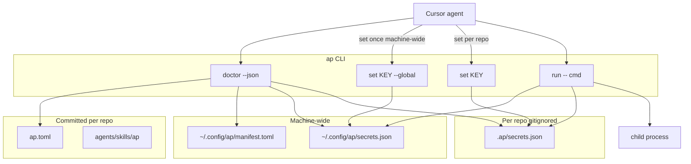

# Agent-portable secrets CLI (local-first, standalone)

## Decision (from your feedback)

- **Local-first** for v0: no 1Password dependency, no cloud sync, no encryption ceremony on day one.
- **Standalone utility** — not nested in any platform runtime secret store.
- **Two-tier storage**: machine-wide creds (repo-to-repo) + per-project creds (repo-specific).
- **Consumer repos** use it via a committed manifest + skill, not by owning the tool.

---

## Problem we're solving

Today's flow (Namecheap API key in chat) breaks three things:

1. **Security** — secrets in chat logs / transcripts
2. **Portability** — credentials live in shell env or memory, not in a discoverable project contract
3. **Agent UX** — agents can't tell what's missing, what's public, or what to ask the user

1Password's `op://` + `op run` solves (1) and (3) partially, but lacks:

- Project-scoped **readiness** (`doctor --json`: missing keys + exact ask text)
- **Visibility tiers** (public / secret / derived) in a committed manifest
- **Skill-declared dependencies** agents can check before acting
- Zero external SaaS for solo/dev use

---

## Proposed tool: `ap` (Agent PORTable secrets)

New repo: **`ap`** — Bun CLI, single binary, zero platform deps.

### Two-tier layout

```text
# Machine-wide (set once, use in every repo)
~/.config/ap/
  manifest.toml     # global key definitions (ask text, visibility)
  secrets.json      # global secret values — mode 0600

# Per-project (committed contract + gitignored values)
<repo>/ap.toml   # which keys this repo needs; scope per key
<repo>/.ap/
  secrets.json      # project-only values — mode 0600, gitignored
```

Use XDG `~/.config/ap/` (override via `AP_GLOBAL_HOME`). Project discovery: walk up from `cwd` to find `ap.toml` (same pattern as git root).

### Scope model

Each var in a project `ap.toml` declares where its **value** lives:

| `scope` | Value store | Typical use |
|---------|-------------|-------------|
| `global` (default for shared keys) | `~/.config/ap/secrets.json` | Namecheap API, personal CF token, npm publish token |
| `project` (default for repo keys) | `<repo>/.ap/secrets.json` | `DEPLOY_TOKEN` for this repo, repo-specific DB override |

**Resolution precedence** (same key name):

1. Project vault value (if `scope = "project"`)
2. Global vault value (if `scope = "global"`)
3. Inline `value` in manifest (public only)
4. `derive` resolver

Project **overrides** global metadata (`ask`, `used_by`) but not the storage location unless you re-declare `scope`.

### Manifest formats

**Global** (`~/.config/ap/manifest.toml`) — canonical definitions for machine-wide creds:

```toml
version = 1

[var.NC_API_USER]
visibility = "public"
value = "UsysD3nN39n4Mi"

[var.NC_API_KEY]
visibility = "secret"
ask = "Namecheap Profile → Tools → API Access: enable API, whitelist IP, paste key."
docs = "https://www.namecheap.com/support/api/intro/"

[var.CLOUDFLARE_API_TOKEN]
visibility = "secret"
ask = "Cloudflare dashboard → API Tokens → Pages Edit + Account Read"
```

**Project** (`ap.toml`) — declares what this repo needs; references global or project storage:

```toml
version = 1

[var.NC_API_KEY]
scope = "global"               # value from ~/.config/ap; set once machine-wide
used_by = ["namecheap.domains.check"]

[var.NC_CLIENT_IP]
scope = "global"
visibility = "derived"
derive = "public-ipv4"

[var.DEPLOY_TOKEN]
scope = "project"              # per-repo / per-env operator cred
visibility = "secret"
ask = "Deploy token for this environment"
```

**Visibility contract (agent-safe `--json`):**

| Tier | In `doctor --json` | In `run` subprocess |
|------|-------------------|---------------------|
| `public` | full value | set |
| `secret` | `{ status, ask, scope, storage, masked: true }` — no value | set |
| `derived` | resolved value | set |

`doctor --json` adds `storage: "global" | "project" | "inline" | "derived"` so agents know whether to tell the user `ap set KEY --global` vs `ap set KEY`.

---

## CLI surface (registry-driven internally, `--json` on all reads)

### Project commands (run inside a repo)

| Command | Purpose |
|---------|---------|
| `ap init` | Scaffold `ap.toml` + `.gitignore` entry for `.ap/` |
| `ap set KEY` | Read stdin → project vault (`.ap/`) |
| `ap set KEY --global` | Read stdin → global vault (`~/.config/ap/`) |
| `ap adopt KEY [--global]` | Copy from `process.env` into vault |
| `ap unset KEY [--global]` | Remove from vault |
| `ap list --json` | Project manifest keys + status; no secret values |
| `ap doctor --json` | **Primary agent entrypoint** — project keys, global resolution, `ask` text |
| `ap schema --json` | Merged manifest export for agents/skills |
| `ap run -- <cmd>` | Resolve project keys (global + project stores) → spawn subprocess |
| `ap print KEY --json` | Public/derived only; errors on secret keys |

### Global commands (machine-wide, no project required)

| Command | Purpose |
|---------|---------|
| `ap global init` | Scaffold `~/.config/ap/manifest.toml` |
| `ap global set KEY` | Set machine-wide secret (stdin) |
| `ap global list --json` | All global keys + status |
| `ap global doctor --json` | Machine readiness without a project context |

Example agent flow (Namecheap — global cred, any repo):

```bash
ap doctor --json
# → NC_API_KEY missing, storage: "global", ask: "Namecheap Profile → ..."

# User sets once on this machine (not in chat, not per-repo):
echo "$KEY" | ap set NC_API_KEY --global

ap run -- curl ...   # works in any repo with ap.toml
```

`doctor --json` shape:

```json
{
  "ready": false,
  "project": "/Users/william/dev/my-app",
  "global_home": "/Users/william/.config/ap",
  "vars": [
    { "key": "NC_API_USER", "scope": "global", "storage": "inline", "visibility": "public", "status": "set", "value": "Usys..." },
    { "key": "NC_API_KEY", "scope": "global", "storage": "global", "visibility": "secret", "status": "missing", "ask": "Namecheap Profile → ...", "set_with": "ap set NC_API_KEY --global" },
    { "key": "DEPLOY_TOKEN", "scope": "project", "storage": "project", "visibility": "secret", "status": "set" }
  ]
}
```

`set_with` field tells agents the exact command to give the user — no guessing `--global` vs project.

---

## Architecture



**Package layout (standalone repo):**

```
ap/
  deno.json
  src/
    main.ts           # argv dispatch
    manifest.ts       # parse/validate ap.toml
    vault.ts          # read/write global + project stores
    resolve.ts        # scope-aware merge: global manifest + project manifest + vaults + derived
    doctor.ts
    run.ts
    mask.ts           # redaction helpers
    derives.ts        # public-ipv4, etc.
  schema/
    ap.schema.json # machine-readable contract
  test/
```

Install: `bun link` from this repo (see `bin/ap`) or add repo `bin/` to PATH.

---

## Consumer repo integration

Minimal changes in any repo that needs agent-operated secrets:

1. User runs once: `ap global init` + sets shared creds (`NC_API_KEY`, `CLOUDFLARE_API_TOKEN`, etc.)
2. Add `ap.toml` at repo root — project keys with `scope = "global"` for shared creds, `scope = "project"` for repo-specific ones
3. Add `.ap/` to `.gitignore`
4. Add `.cursor/skills/ap/SKILL.md`
5. Skill rules:
   - **Never** ask user to paste secrets in chat
   - Run `ap doctor --json` before external API tasks
   - If missing: show `ask` + `set_with` from doctor output (respects `--global` vs project)
   - Execute external calls via `ap run -- <cmd>`
5. Optional skill frontmatter extension (v0.2):

```yaml
requires:
  - NC_API_KEY
  - NC_API_USER
```

Agent checks `doctor --json` against `requires` before proceeding.

**Keep [`.env.example`](.env.example)** for human-oriented Postgres/hosted vars; `ap.toml` for agent-operated third-party API creds. Overlap is OK — `ap adopt` migrates existing `.env` values.

---

## How this beats 1Password (for agents)

| | 1Password `op run` | `ap` |
|--|-------------------|---------|
| Setup | Account + CLI sign-in | `ap init` + `ap set` |
| Committed contract | `.env` with `op://` refs only | `ap.toml` with visibility + `ask` + `docs` |
| Agent readiness | Manual / `op read` per key | `ap doctor --json` |
| Public vs secret | All refs look the same | Explicit `visibility` tier |
| Derived values | Manual | `derive = "public-ipv4"` |
| Portability | Tied to 1Password vault | Machine-global + per-project; works offline |
| Cross-repo creds | Same op:// ref in each .env | `scope = "global"` — set once with `--global` |
| Team sync | Built-in | v1: `op://` resolver adapter (optional backend) |

---

## Phased delivery

### v0 — ship local-first standalone (this plan)

- `ap` CLI + `ap.toml` schema with `scope` field
- Global store (`~/.config/ap/`) + project store (`.ap/`)
- `global init/set/list/doctor` + `set --global` + scope-aware `doctor` / `run`
- `public-ipv4` derive
- Consumer manifest + skill + gitignore; shared creds documented as global

### v0.1 — ergonomics

- `ap init --from-env-example .env.example` (scaffold secrets from comments)
- Shell completion
- `ap commands --json` for agent introspection

### v1 — team + backends (optional)

- `source = "op://vault/item/field"` resolver (1Password adapter, not required)
- `age` encryption for `.ap/`
- `ap push --target <platform> --env local KEY` bridge to remote secret stores (optional)

---

## What we explicitly defer

- Merging with hosted platform secret storage
- Remote/cloud vault sync
- Encrypting v0 local store (plain file + 0600 is enough to ship)
- Bundling into `packages/cli` (stay standalone; optional thin wrapper later)
